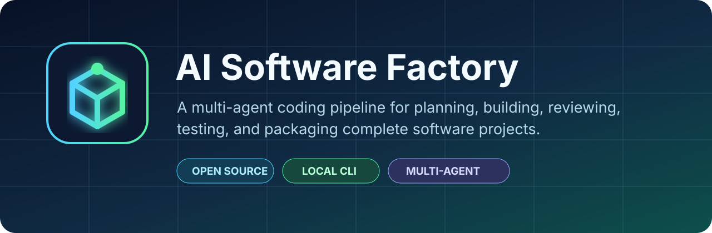
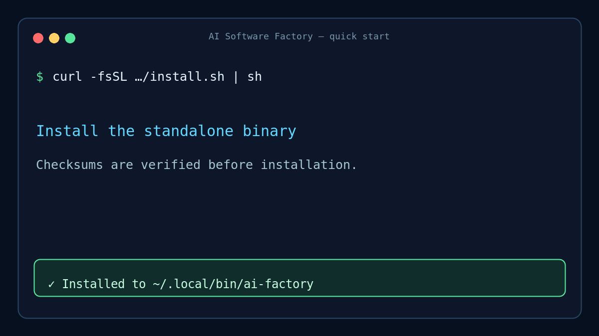
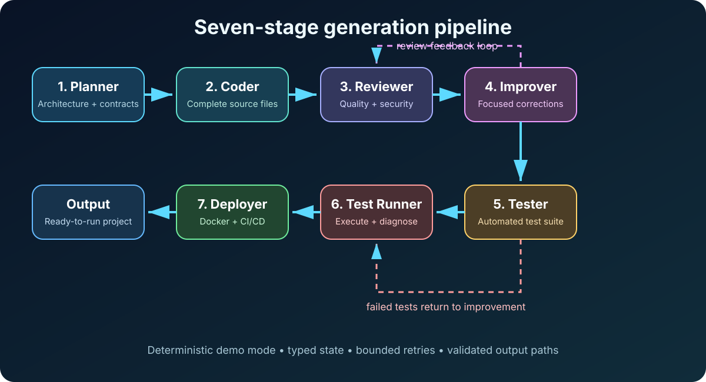

  

  
  
  
  
  

  <strong>Plan, generate, review, test, and package complete software projects from one terminal command.</strong>

AI Software Factory is an open-source multi-agent coding CLI. Seven focused agents
work through architecture, implementation, review, improvement, testing, failure
analysis, and deployment packaging. It supports live OpenAI-backed generation and a
deterministic offline demo that needs no API key.

> **Project status:** version 0.3.0 adds read-only repository inspection, scoped
> AGENTS.md instructions, validated repository tools, and a provider-neutral agent
> runtime foundation. Greenfield generation remains stable; live repository editing,
> approvals, and OS-enforced sandboxing are still in progress. See
> [docs/ROADMAP.md](docs/ROADMAP.md).

## Demo

  

  <a href="docs/assets/demo.mp4">Watch the MP4 walkthrough</a> ·
  <a href="docs/DEMO.md">Regenerate the media</a>

## Highlights

- **Seven specialized agents** instead of one oversized prompt.
- **Review and repair loops** with bounded retry counts.
- **Generated tests and deployment files** alongside application source.
- **Deterministic demo mode** for evaluation, documentation, and CI.
- **Validated output paths** that reject traversal and symlink escapes.
- **Standalone binaries** for Linux, macOS, and Windows.
- **Checksum-verifying installer** for Linux and macOS.
- **Typed failures, tests, linting, type checks, and cross-version CI.**
- **MIT licensed** with contribution, security, support, and release policies.

## Install

### Standalone release binary

Linux and macOS users can install the latest signed-off release artifact without
cloning the repository:

~~~bash
curl -fsSL https://raw.githubusercontent.com/mastaan66/multi-agent-coding-tool/main/install.sh | sh
~~~

The installer downloads the platform archive, verifies its SHA-256 checksum, and
places the executable in ~/.local/bin by default.

~~~bash
ai-factory --help
ai-factory --demo "Build a todo API"
~~~

Install a specific version or destination:

~~~bash
AI_FACTORY_VERSION=v0.3.0 AI_FACTORY_INSTALL_DIR="$HOME/bin" sh install.sh
~~~

Windows users can download the x86_64 ZIP from
[GitHub Releases](https://github.com/mastaan66/multi-agent-coding-tool/releases).

### Standalone source launcher

For contributors or source checkouts, the shell launcher creates and manages a local
virtual environment:

~~~bash
git clone https://github.com/mastaan66/multi-agent-coding-tool.git
cd multi-agent-coding-tool
./ai-factory.sh --demo "Build a todo API"
~~~

run.sh remains available as a compatibility alias.

### Python installation

~~~bash
git clone https://github.com/mastaan66/multi-agent-coding-tool.git
cd multi-agent-coding-tool
python3 -m venv .venv
source .venv/bin/activate
python -m pip install -e .
ai-factory --help
~~~

See [docs/INSTALLATION.md](docs/INSTALLATION.md) for all installation and build
options.

## Quick start

### Repository inspection preview

The v0.3 foundation can discover an existing repository, respect Git ignore rules,
summarize its language mix, and load applicable AGENTS.md instructions without
sending repository content to a model:

~~~bash
ai-factory inspect .
ai-factory inspect . --json
~~~

This command is intentionally read-only. The provider-neutral streaming runtime and
validated read-only tools are now implemented internally; live provider adapters,
patching, approvals, and sandboxed shell execution remain roadmap work.

### Offline demo

No API key and no model request are required:

~~~bash
ai-factory generate --demo "Build a REST API for a todo application"
~~~

### Live generation

Set an OpenAI API key and launch the interactive setup:

~~~bash
export OPENAI_API_KEY="your-key"
ai-factory generate
~~~

Or pass a direct prompt:

~~~bash
ai-factory generate "Create a URL shortener API with analytics"
~~~

Direct prompts without the generate subcommand remain backward compatible.

Useful options:

~~~text
-m, --model MODEL          Override the OpenAI model
--api-key API_KEY          Supply a key for this process
--demo                     Run deterministic offline mode
--review-loops NUMBER      Limit review/improvement retries
--test-loops NUMBER        Limit test/fix retries
--output-dir PATH          Choose the generated-project directory
~~~

Do not put API keys directly on a shared command line. Environment variables or a
local, ignored .env file are safer.

## How it works

  

| Stage | Agent | Responsibility |
|---:|---|---|
| 1 | Planner | Produces architecture, stack, modules, files, and API contracts |
| 2 | Coder | Generates complete project files from the approved plan |
| 3 | Reviewer | Finds correctness, security, performance, and design issues |
| 4 | Improver | Applies review feedback while preserving behavior |
| 5 | Tester | Generates automated pytest coverage |
| 6 | Test Runner | Runs tests, diagnoses failures, and sends fixes back |
| 7 | Deployer | Produces Docker, Compose, CI, and deployment instructions |

The current implementation uses CrewAI for live stage execution and Pydantic for
shared structured state. Demo mode routes the same stages through named deterministic
fixtures.

## Generated output

Each run writes an isolated timestamped project directory:

~~~text
output/
└── todo_api_YYYYMMDD_HHMMSS/
    ├── app/
    ├── tests/
    ├── Dockerfile
    ├── docker-compose.yml
    ├── .github/workflows/ci.yml
    ├── requirements.txt
    └── DEPLOYMENT.md
~~~

Generated code is a development starting point. Review dependencies, authentication,
secrets, migrations, test coverage, and deployment configuration before production
use.

## Standalone executable artifact v1

The first executable artifact format, referred to as **artifact v1**, contains:

- one native ai-factory executable;
- README.md;
- LICENSE;
- a platform archive;
- a matching SHA-256 checksum file.

Release assets use predictable names:

~~~text
ai-factory-linux-x86_64.tar.gz
ai-factory-macos-x86_64.tar.gz
ai-factory-macos-arm64.tar.gz
ai-factory-windows-x86_64.zip
~~~

Build the artifact locally:

~~~bash
python -m pip install -e ".[release]"
make build
dist/ai-factory --help
~~~

Pushing a version tag triggers [.github/workflows/release.yml](.github/workflows/release.yml),
which builds native binaries on each target operating system and publishes them to a
GitHub Release. See [docs/RELEASING.md](docs/RELEASING.md).

## Configuration

| Variable | Default | Purpose |
|---|---|---|
| OPENAI_API_KEY | empty | OpenAI credential for live mode |
| OPENAI_MODEL_NAME | gpt-4o | Default live-generation model |
| OPENAI_TEMPERATURE | 0.2 | Sampling temperature |
| MAX_REVIEW_ITERATIONS | 3 | Review/improvement retry limit |
| MAX_TEST_FIX_ITERATIONS | 3 | Test/fix retry limit |
| OUTPUT_DIR | output | Generated project root |
| AI_FACTORY_INSTALL_DIR | ~/.local/bin | Installer destination |
| AI_FACTORY_VERSION | latest | Installer release selector |
| AI_FACTORY_VENV | .venv | Source-launcher environment |

## Development

~~~bash
python -m pip install -e ".[dev]"
make quality
~~~

Individual commands:

~~~bash
pytest
ruff check .
mypy
bash -n install.sh ai-factory.sh run.sh scripts/build_binary.sh scripts/render_demo.sh
~~~

Regenerate documentation media:

~~~bash
make media
~~~

The test suite includes unit coverage for structured output, path safety, CLI
configuration, release packaging, mock routing, and an offline end-to-end pipeline.

## Security

Model output and generated code are untrusted inputs. The project validates generated
file destinations, but the current command runner is not an OS sandbox. Use a trusted
workspace or an isolated container.

Report vulnerabilities privately using
[GitHub Security Advisories](https://github.com/mastaan66/multi-agent-coding-tool/security/advisories/new).
Read [SECURITY.md](SECURITY.md) before reporting.

## Roadmap

The engineering roadmap covers the transition from a greenfield generator to a
repository-native coding agent with:

- provider adapters and native tool calling;
- repository search and focused patch tools;
- permissions and OS-enforced sandboxing;
- persistent sessions, checkpoints, resume, and undo;
- AGENTS.md, hooks, skills, and MCP;
- worktree-isolated parallel agents.

See [docs/ROADMAP.md](docs/ROADMAP.md) for phases, acceptance criteria, and the
prioritized backlog.

## Community

- [Contributing guide](CONTRIBUTING.md)
- [Code of Conduct](CODE_OF_CONDUCT.md)
- [Security policy](SECURITY.md)
- [Support](SUPPORT.md)
- [Changelog](CHANGELOG.md)
- [Installation guide](docs/INSTALLATION.md)
- [Release guide](docs/RELEASING.md)
- [Issue tracker](https://github.com/mastaan66/multi-agent-coding-tool/issues)

Contributions are welcome. For substantial features, open an issue before
implementation so the design can be aligned with the roadmap.

## License

AI Software Factory is available under the [MIT License](LICENSE).
